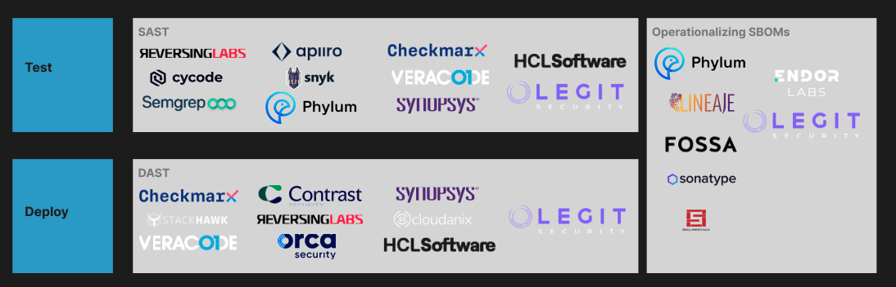

# SSC / SDLC Ecosystem Companion Write-Ups

[Ecosystem Map](https://www.figma.com/file/D0269BAXNd7xfW63TIOVW4/SSC-%2F-SDLC-Ecosystem-Map-(WIP)?node-id=0-1&t=8P8oCFhpClQ5eKqH-0)

# Intro

Third-party dependencies are core to software development. In 2021, over 2.2 trillion open-source packages or components were borrowed from third-party ecosystems. Almost all codebases, ranging from 85% to 97% of enterprises, contain open-source code. Third-party development tools, pipelines, and infrastructure are also widespread. These dependencies and tooling make up the modern software supply chain. This long-tail chain of code, components, and OSS libraries are an enormous cyber-attack surface area.

In 2021, supply chain attacks increased by 650% from the year prior, and Gartner estimates that by 2025, 45% of all organizations will experience attacks on their software supply chain. Breaches in any link of the software supply chain can impact organizations and many similar targets. Recent widespread and cascading breaches have brought the discussion of software supply chain security to the top of many CISOs’ priority lists for 2023. According to Gartner, 44% of companies surveyed reported that they will substantially increase supply chain security by 5-10%, and 18% expect to increase it by more than 10%.

This ecosystem map is an attempt to show how key players are plugging into the SDLC lifecycle to secure the modern software supply chain. There are three major categories of threats that these vendors attempt to mitigate:

- Source threats
- Build threats
- Deployment & runtime threats

Vendors seek to prevent these threats through a variety of methods, starting from vulnerability scanning up to and including dynamic AppSec testing & continuous compliance monitoring. Let’s break down each part of the SDLC lifecycle and understand who’s doing what at each step.

# Source

Source threats compromise the integrity of source code, wherein the risk is primarily related to to the potential for a bad actor to introduce bad or unexpected software that is outside the original intent of the software producer. The primary prevention tool against source threats is Software Composition Analysis (SCA), which is meant to flag OSS code against a library or database of known vulnerabilities found in NVD or CVE. 

Vendors also offer dependency management solutions, the core idea of which is to go a step beyond SCA in just understanding if your software is using a vulnerable OSS component. Not all vulnerabilities are equal - the depth and transitive dependencies of ***how*** a vulnerable component in your software is used are arguable more important to assessing the true risk of a vulnerability. 

Vendors such as Jit, Blink Ops, and Arnica take things a step upstream in offering solutions to automate key protocols in the common tooling that software producers use today. Simple automations like automatically cleaning up shared Google Drive folders, automating towards least required privilege for devs, re-confirming users on Okta when they perform a suspicious action, and automatically deleting stale branches can help with the “shift-left” mindset so prevalent today and minimize the risk of human error introducing opportunities for bad actors to compromise software sources. 

Both Legit Security and Arnica have extended their pipeline security controls to include developer access management. Legit requires multi-factor authentication, code reviews, branch protection, and regular third-party integration audits. It also sets up alerts for suspicious activities like bypassing a code review. Arnica adds behavioral components to access management, reducing developer permissions based on historical patterns of access and automating the process for developers to regain permissions via communication tools like Slack. These measures help companies reduce the impact of an any kind of account-takeover attack or malicious insider threat.

# Build & Package

There are two broad segments of vendors helping to secure the build & package process:

- Code-level solutions
- Pipeline-level solutions

Within code-level solutions, there are several vectors for securing the supply chain:

- Container images
    - Chainguard is a leader in this space, optimizing for a ‘secure by default’ approach to building software. By securing the container’s base image, developers can rest assured that all downstream builds will inherit known-to-be-secure images.
- Container optimization
    - Organizations often deploy containerized software to production with unnecessary software, such as libraries, OS binaries, package managers, and more. To build secure by default, companies need to minimize code footprint in production to reduce complexity, software attack surface, and risk. Two key players in this spaceare [Slim.ai](http://slim.ai/) and Rapidfort. Both companies optimize containers automatically, so only necessary components are included. Developers can provide configurations or use vendor recommendations, and post-optimization analyses detail which files, packages, and vulnerabilities were removed.
- Container scanning
    - Snyk is a great example of a vendor that offers automated remediation of vulnerabilities found in containers, using methods and convenience-focused features such as IDE integrations and native Git scanning and monitoring. Vendors in this space usually offer capabilities to continuously monitor containers after deployment as well.
- Secret detection & mitigation
    - Unmanaged secrets are present at all levels of the modern development environment, such as code repositories, build logs, kubernetes clusters, and unpublished version histories. "Hard-coded secrets" are especially dangerous since they are plain-text credentials embedded into source code, allowing attackers to move laterally once they compromise a company's code repository. Truffle Security and GitGuardian offer pre-commit hooks that scan staged changes for secrets, enabling developers to self-remediate potential vulnerabilities before they appear. Arnica provides organization-wide secret management, allowing for comprehensive coverage and real-time enforcement of a zero-new hardcoded secrets policy beyond just the parts of the CI/CD pipeline protected by pre-commit hooks. Doppler takes a more traditional approach, offering a centralized secrets store that developers can securely reference. The company also provides automatic rotation of database and API key secrets on a cadence without downtime through infrastructure integrations, reducing the risk of a leak or breach.
- Infra-as-code (IaC) scanning:
    - IaC scanning tools analyze code for infrastructure resources, such as virtual machines, networks, and storage. They detect security risks and provide insights to developers and security teams. Examples of IaC scanning tools include Terraform Sentinel, AWS Config Rules, and Azure Policy. These tools have pre-built rulesets to evaluate security and compliance of cloud infrastructure code. Integrating IaC scanning into DevOps pipeline helps identify and address security issues proactively. Snyk and Cycode offer free/freemium solutions for such workflow optimizations.

Pipeline-level approaches include the following sub-categories

- Anomalous behavior detection
    - Arnica is an innovator in this space - they offer patented technology that fingerprints every developer in an organization’s codebase, which enables them to flag suspicious commits. This is a great way of understanding if developer access has been compromised, allowing security teams to flag issues before they even make it to the build process.
- CI/CD Posture management
    - Today, software supply chain security often stops at the code level. Enterprises lack visibility into their full SDLC systems and must manually track the infrastructure used within development environments. CI/CD posture management vendors automate the SDLC discovery process and enforce security best practices at the pipeline level.
    For vendors like Tromzo, this means addressing vulnerable misconfigurations in the SDLC and IaC. Tromzo's CI/CD posture management solution ensures build servers require authentication, limits the creation of public repositories, limits publicly writable S3 buckets, and sets security keys to expire by default. The company also constrains risky development practices like executing third-party resources before verification (e.g., a checksum or manual review) or referencing images in a build that may be changed externally to address potential pipeline vulnerabilities.
    - Generally, vendors like Enso or Legit Security offer native integrations with popular CI/CD tooling to ensure easy coordination across pipeline tools and flag when security drift has occurred across teams.

# Testing & Deployment

As one may expect, the Static Application Security Testing (SAST) landscape has largely been commoditized. Most cybersecurity vendors offer some shape of a solution that scans proprietary and/or open-source code components against known vulnerabilities. 

Dynamic Application Security Testing (DAST) has been similarly commoditized, wherein several vendors offer solutions along the lines of performing security testing on running applications, testing for a variety of real threats like SQL injections, OS injections, and cross-site scripting without requiring access to source code. This is a form of black box testing, which can identify application vulnerabilities from an attacker’s perspective.

SCA tools can identify dependency vulnerabilities in source code, but they may miss new vulnerabilities introduced in the latest code changes. Additionally, SCA, SAST, and DAST tools only work at specific points during software development and do not detect supply chain attacks that may occur outside of these checkpoints, such as during debugging or runtime. Current scanners only provide visibility into code-level security and not pipeline-level security. Lastly, a crucial downside of scanners is that they often provide long lists of nested issues that are plagued with false positives. 

# Production

IAST testing is done in real-time while the application runs in the staging environment, enabling it to quickly identify the line of code that causes security issues and notify the developer for immediate remediation. This method also checks source code like SAST, but it does so at the post-build stage rather than during code build. IAST agents are typically deployed on application servers. When a vulnerability is reported by the DAST scanner, the IAST agent deployed returns the line number of the issue from the source code. During functional testing by a QA tester, the deployed IAST agent studies every pattern of data transfer inside the application, whether it's dangerous or not. This space is similarly commoditized by several key vendors like Legit Security & Contrast Security, who largely offer overlapping capabilities. 

Continuous Compliance refers to the process of continuously monitoring and ensuring compliance with security and regulatory requirements throughout the software supply chain. This involves implementing security controls and measures that are designed to meet compliance requirements and prevent security risks at every stage of the SDLC. Traditionally, compliance has been a manual and static process, where organizations conduct periodic audits and assessments to ensure that they are meeting regulatory requirements. Vendors like Arnica offer out-of-the-box solutions that let software producers automatically monitor permission-level compliance in accordance with a variety of government mandates. SBOM artifacts are often used as the lynchpin of continuous compliance monitoring & reporting:

- Legit Security's SBOMs enable faster security responses, license tracking, and facilitate inventorying software components and vulnerability scanning.
- Chainguard’s SBOMs are leveraged for continuous verification, ensuring packages in development remain in compliance with no vulnerabilities even post-deployment

# SBOMs

Most software supply chain vendors produce some flavor of SBOM. They key differences manifest when examining when they’re produced, how they’re managed, the degree to which they are enriched, and how they are operationalized. 

[Lineaje](https://www.lineaje.dev/products/SBOM360) is an upstart player that demonstrates how fully enriched SBOMs can be enriched, managed, and published. Their SBOM 360 product automatically handles attestation and can be generated at any point in the build and deployment process. They support legal & procurement compliance use cases automatically, and they automatically map supplier-level transitive dependencies. They operationalize SBOMs within their hosted repo by letting software producers define their compliance policies, or by letting you see how you’re compliant with rules like EO14028.

[Phylum](https://blog.phylum.io/insights-and-resources/if-sboms-are-a-must-lets-make-them-as-effective-as-possible) is a more established player in the space that’s actively driving thought leadership in completing the SBOM picture. They focus on continuous creation, contextualization within the context of your codebase, and policy-level automations. [Endor Labs](https://www.endorlabs.com/sbom-management) is another emerging player that does an excellent job of operationalizing SBOMs - they use call graphs to map out dependencies flagged within SBOMS, enabling DevSecOps teams to truly understand whether or not vulnerable dependencies are actually reachable issues worth prioritizing. 

Larger vendors like [Arnica](https://www.arnica.io/solution/sbom) and [Riscosity](https://www.riscosity.com/sbom/) offer simpler SBOM solutions that are more a part of a larger feature set. They focus more on “crossing the box” of offering an SBOM, and somewhat throttle when and how they’re produced. (With Arnica, SBOMs are generated for each repo daily at a set schedule). 

---

# What it means to win the SDLC / how to get to winning

Chainguard’s “secure by default” approach to software development is a true innovation in the market to secure the software supply chain. In an era when software spend is facing contraction pressure unseen in years, survival & winning will be defined by innovating in a category and capturing as much of a given workflow as possible. Chainguard is on track to shine in the former category, and the opportunity is boundless within the latter. The key will be to precisely define exactly how Chainguard should expand its capabilities to capture more key elements of the ecosystem map outlined above. In short, our goals should be to:

1. Make sure the requisite urgency in the messaging around why a “secure by default” approach is critical for software producers, and determine a distribution strategy to get the word out
2. Develop a product roadmap to expand upon Chainguard’s product offerings into the highest-leverage & under-commoditized points of the SDLC ecosystem map

## 1. Urgency, messaging, and distribution

Possible tactics:

- Focus on developer experience & ease of use in messaging and marketing materials
    - Publish thought-leadership pieces, start an engineering blog
- Develop self-serve onboarding experiences for a variety of known base images that are relevant across industries. Leverage known software development standards for different types of applications. Make these experiences free.
    - Focus on earlier-stage companies which are often leaner. Security shouldn’t be an afterthought until a company’s achieved scale.
- Price competitively against other SDLC players, focus on “land & expand” strategy to gain market share (coupled with product expansion to be discussed below)

## 2. Product expansion

Application security testing across the board has largely been commoditized. Additionally, several platforms like Legit Security, Arnica, Synk, Sonatype, and Phylum come across as trying to do it all. Chainguard should approach product expansion by gradually expanding into feature sets that are adjacent to and fit nicely with a ‘secure by default’ approach.

Ideas

- Get into the container optimization space to take marketshare for slim.ai, rapidfort, etc. Help software producers easily transition/convert container optimization workflows into chainguard base images.
- Offer secret detection/mitigation and developer access management as first-class citizens in Chainguard’s platform.
- Fully lean into legal & compliance use cases, offering out-of-the box checks that software is compliant with any regulation
- Help organizations better their CI/CD security posture by natively integrating with leading CI/CD tooling. Incorporate ‘secure by default’ mindset into working with pipeline development & management.
